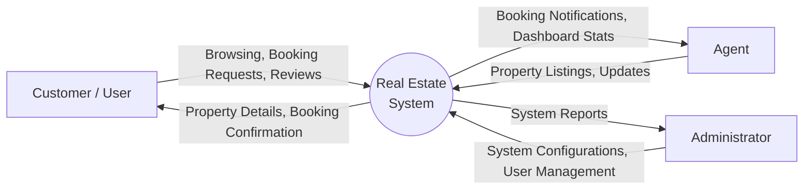
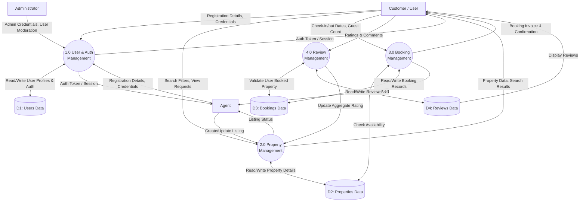

# Data Flow Diagram (DFD)
## Real Estate Booking Management System

### Level 0: Context Diagram

The Context Diagram shows the system as a whole and its interactions with external entities.

---

### Level 1: System Processes

The Level 1 DFD breaks down the main system into its major sub-processes.

### Process Descriptions

1.  **1.0 User & Auth Management**: Handles user registration, login (using bcrypt for passwords), profile updates, and role assignments. It issues authentication tokens to users.
2.  **2.0 Property Management**: Allows agents to add, edit, or remove properties. It provides advanced search and filtering capabilities for customers based on location, price, and amenities.
3.  **3.0 Booking Management**: Manages the reservation lifecycle. It verifies property availability via Process 2/Data Store 2, calculates total prices, records the booking, and triggers notifications to the respective agent.
4.  **4.0 Review Management**: Accepts ratings and comments from customers for properties they have interacted with. It validates eligibility, stores the review, and recalculates the average property rating.
