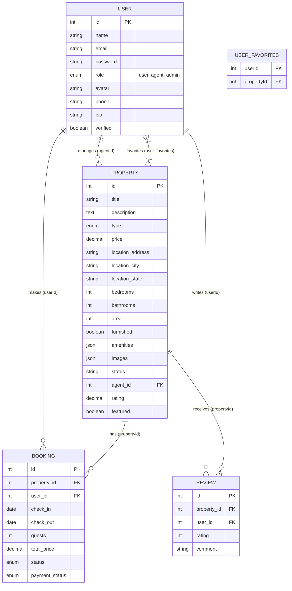

# Entity-Relationship (ER) Diagram

The following Mermaid diagram represents the relationships between the core entities in the database: `Users`, `Properties`, `Bookings`, `Reviews`, and `User Favorites`.

### Relationships Explained
1. **User (Agent) to Property**: A One-to-Many relationship where an Agent can have multiple properties listed.
2. **User to Booking**: A One-to-Many relationship where a User can make multiple bookings over time.
3. **Property to Booking**: A One-to-Many relationship where a single property can have multiple bookings associated with it.
4. **User to Review**: A One-to-Many relationship where a User can write multiple reviews for different properties.
5. **Property to Review**: A One-to-Many relationship where a Property can receive multiple reviews from different users.
6. **User to Property (Favorites)**: A Many-to-Many relationship managed by a junction table (`user_favorites`), allowing users to favorite many properties, and properties to be favorited by many users.
